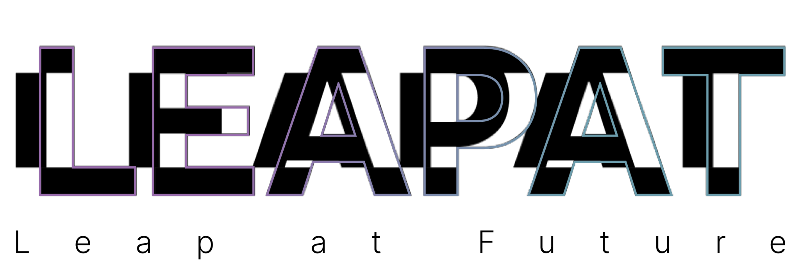

Leapat is a youth-led tech initiative founded in early 2024. Our mission is to drive comprehensive digital transformation across key sectors such as the economy, health, education, culture, and art.

# Developer Guide

### Dependencies

- Next.js 14
- Node.js
- Supabase

### Branches

> **Note:** `develop` is the branch for integrating new features, while `main` is reserved for production-ready code.

### Environments

- `production`: The live environment used by end users.

## Contributing

We welcome contributions to the Leapat website! Please refer to the [Contributing to Leapat website guide](https://github.com/Leapat-mukalla/leapat/blob/main/CONTRIBUTING.md) for detailed instructions.

### Leapat UI on Figma

1. [Figma Design - Link 1](https://www.figma.com/design/cUuo0esdZ5YgTWMFAMTgnO/leapat?node-id=0-1&t=lz0ymjbFiCD1pf9F-0)
2. [Figma Design - Link 2](https://www.figma.com/design/cUuo0esdZ5YgTWMFAMTgnO/leapat?node-id=0-1&t=SmQZ3gssCfRPO1Zi-0)

## Maintainers

## Maintainers

We are grateful for the contributions and guidance of the following maintainers:

|  |  |
|:--:|:--:|
| [MaJeD BoJaN](https://github.com/majedbojan) | [Muhammad Al-jefry](https://github.com/mhmdAljefri) |

Feel free to reach out to any of the maintainers for questions or guidance.
